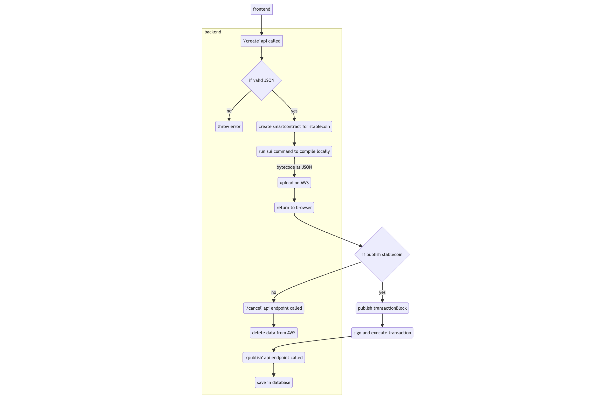
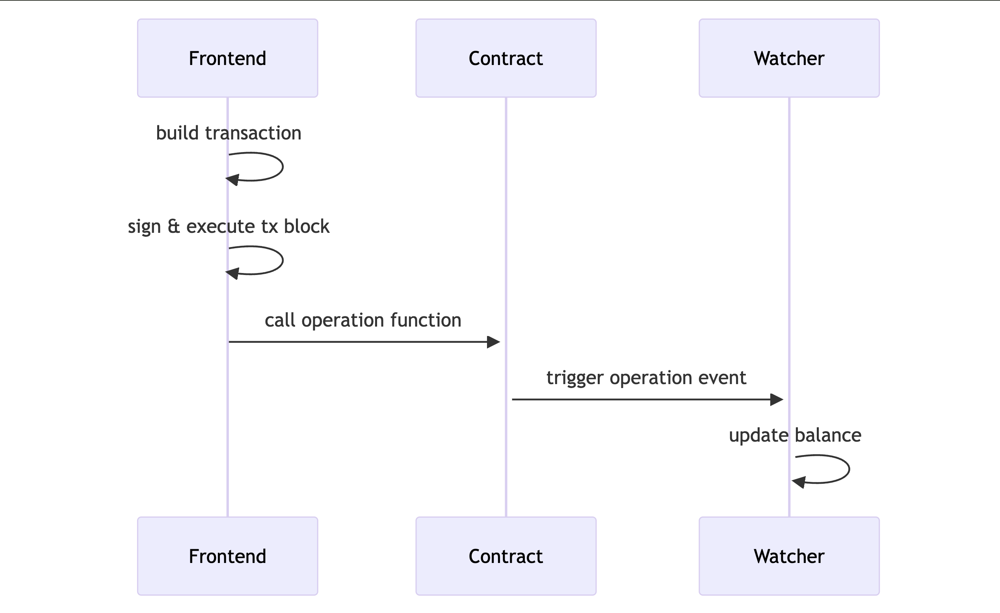

# S3.Money

## Introduction

Many DeFi projects and protocols operate on the SUI Blockchain. They're seeking an easier, code-free method to tokenize their services. The challenge lies in creating Smart Contracts from scratch and dealing with the high hourly costs of hiring developers. 

To address this need, our S3 Platform aims to provide a user-friendly interface that allows these projects to issue and manage their own stable coins. By simplifying the process and reducing the need for extensive coding, we aim to lower barriers to entry and encourage more widespread adoption of DeFi services on the SUI Blockchain.

## Architecture

This section primarily describes the architectural details of the various workflows that users can engage in.

### Create new stablecoin 

- The user links their wallet to the frontend and completes a form outlining the token they wish to create.
- The frontend sends this contract data to the backend via the `/create` endpoint
- The contract details, including ticker, names, and roles, are sent as JSON format. This JSON data is verified, and based on it, a smart contract is generated.
- The backend uses the sui command-line tool to save the data in DynamoDB, uploads a zip file of the contract to Amazon S3, and then sends the compiled data back to the frontend.
- If the user decides to cancel the deployment, the frontend calls the `/cancel` endpoint on the backend, removing the contract details from DynamoDB and Amazon S3.
- If the contract is successfully deployed on the blockchain, the frontend receives deployment transaction details from the wallet and forwards them to the backend using the `/published` endpoint.
- See (link for backend readme ) for more details on this flow.

### Operations 

- The user can choose from various operations related to their stablecoin, such as Pause, Unpause, Freeze, Unfreeze, Mint, Burn, and Cash In.
- When the user decides to perform any operation, the frontend sends a call to the contract where the corresponding function is executed. Additionally, the contract makes an additional call to the watcher, which updates the balance for the stablecoin based on the operation performed.
- Along with the call to the contract function, the transaction is built, signed, and executed within the transaction block.

## Community 
Join our community and stay connected with the latest updates and discussions:

- [Join our Discord community chat](https://discord.com/invite/zjgyDXqhdy) to engage with other users, ask questions, and participate in discussions.