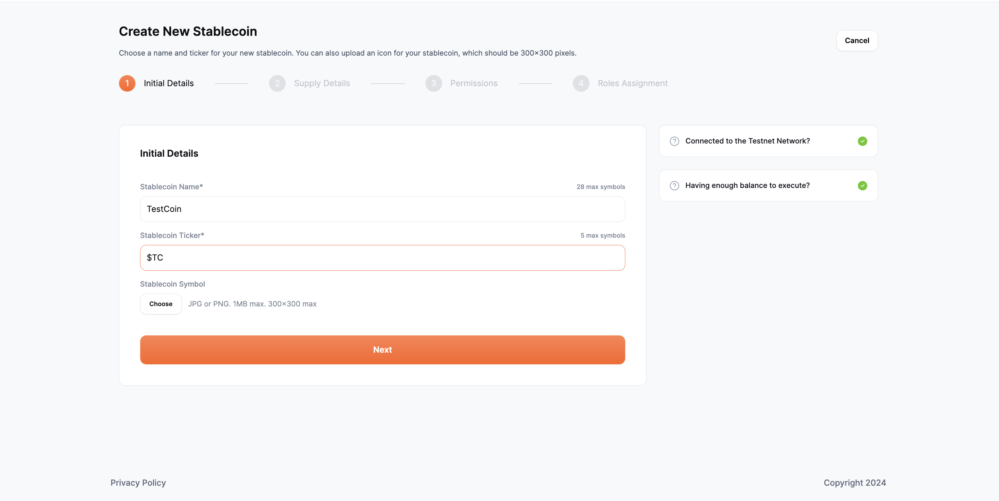

# Initial details

The following fields need to be filled out.

- **Stablecoin name**: Add the name of your new stablecoin such as “TestCoin”. The maximum character input allowed is 28 characters.
- **Stablecoin ticker**: Add the ticker symbol that would represent your stablecoin, such as “$TC”.The symbol "$" will automatically accompany every ticker symbol. The ticker should not exceed 5 characters.
- **Stablecoin symbol**: This is an optional field where the user can also upload a JPG on PNG image to be used as the stablecoin symbol. The maximum size can be 1MB of the file uploaded as the stablecoin symbol

Upon completing the initial steps, you will be directed to the next step, which involves providing supply details.

