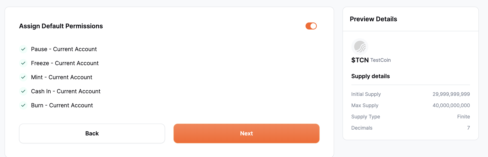

# Permissions

When creating a stablecoin, users have various essential configuration choices to specify which operations the account can perform. 
The operations along with their brief description are listed below

- **Cash In**: Similar to depositing money into a bank account. When you "Cash In" with a stablecoin, depositing it into your stablecoin account (like putting money into a bank account),which boosts the total amount of funds you have available.

- **Burn**: In the context of stablecoin it's like withdrawing money from a bank account. It allows an account to permanently remove tokens from circulation, reducing the total supply of tokens.

- **Pause**: Grants the ability to halt all token-related activities temporarily in case of emergency or scheduled maintenance. This can be understood as a bank temporarily suspending certain services or transactions for all accounts

- **Freeze**: Stops transfers of the specified token for that account. Once frozen, the account cannot send or receive tokens. This can be due to various compliance-related or operational reasons​​. It’s similar to freezing a bank account. When a bank account is frozen, no transactions can be made from or into that account until the freeze is lifted

By default, during the stablecoin creation process, all permissions are automatically assigned to the deployer account. If there's a need to grant permissions to a different account, that can be accomplished in the next step through role assignment.
