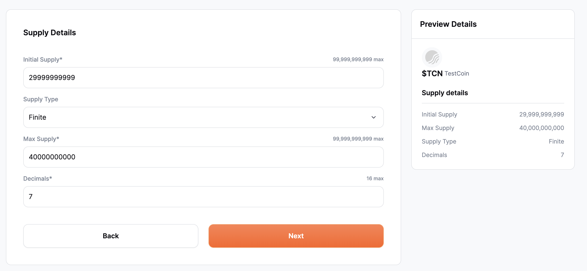
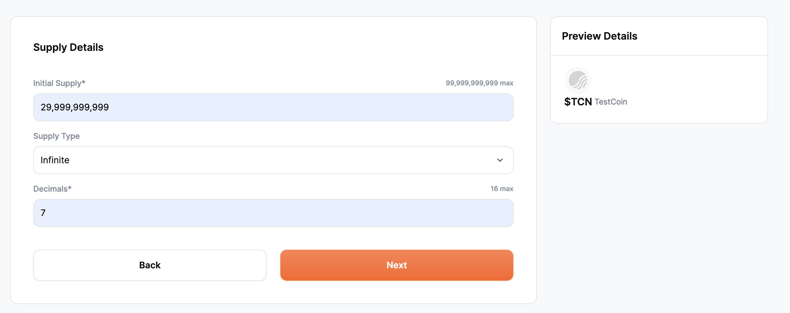
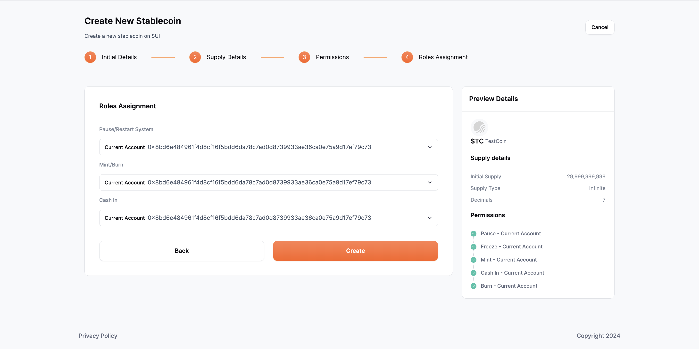

# Create new stablecoin

The first step in creating a new stablecoin is to add the initial details. 

## Initial details

The following fields need to be filled out.

- **Stablecoin name**: Add the name of your new stablecoin such as “TestCoin”. The maximum character input allowed is 28 characters.
- **Stablecoin ticker**: Add the ticker symbol that would represent your stablecoin, such as “$TC”.The symbol "$" will automatically accompany every ticker symbol. The ticker should not exceed 5 characters.
- **Stablecoin symbol**: This is an optional field where the user can also upload a JPG on PNG image to be used as the stablecoin symbol. The maximum size can be 1MB of the file uploaded as the stablecoin symbol

Upon completing the initial steps, you will be directed to the next step, which involves providing supply details.

## Supply details

This step involves adding the following details related to the supply of the stablecoin:

- **Initial supply**: Specify the initial number of stablecoin that will be minted (created). When you specify the initial number of stablecoins that will be minted, you are essentially setting the starting supply of your stablecoin. Only numbers are accepted in this field and the maximum character length is 11.

- **Supply type**: This indicates the maximum number of stablecoins that can exist throughout its existence. Users can choose between two options:

  - **Finite**: If the user opts for this, they also have to define a value for Max Supply. Setting the supply type to finite means the stablecoin can be minted up to a certain amount set as the Max Supply value. 
  Only numerical values are permitted in this field, and the maximum character limit is 11. 

  - **Infinite**: Setting the supply type to infinite means the stablecoin can be minted as many as the user wants.

  

- **Decimals**: The user can set decimals to get more precision. This determines how divisible a token can be. The maximum allowed value for this field is 16.

After doing so, the user can move on to the next step, which involves granting permissions 

## Permissions

  

When creating a stablecoin, users have various essential configuration choices to specify which operations the account can perform. 
The operations along with their brief description are listed below

- **Cash In**: Similar to depositing money into a bank account. When you "Cash In" with a stablecoin, depositing it into your stablecoin account (like putting money into a bank account),which boosts the total amount of funds you have available.

- **Burn**: In the context of stablecoin it's like withdrawing money from a bank account. It allows an account to permanently remove tokens from circulation, reducing the total supply of tokens.

- **Pause**: Grants the ability to halt all token-related activities temporarily in case of emergency or scheduled maintenance. This can be understood as a bank temporarily suspending certain services or transactions for all accounts

- **Freeze**: Stops transfers of the specified token for that account. Once frozen, the account cannot send or receive tokens. This can be due to various compliance-related or operational reasons​​. It’s similar to freezing a bank account. When a bank account is frozen, no transactions can be made from or into that account until the freeze is lifted

By default, during the stablecoin creation process, all permissions are automatically assigned to the deployer account. If there's a need to grant permissions to a different account, that can be accomplished in the next step through role assignment.

## Role Assignment

With the help of **Role Assignment** feature user has the option to assign roles to either their current account or other accounts. If the user decides to assign the role to another account then they have to enter the address to assign the specific functionality to that particular address.

After assigning roles click on the **Create** button to broadcast your transaction and create your first stablecoin. 
Afterward, you'll receive a prompt to navigate to the operations tab.

