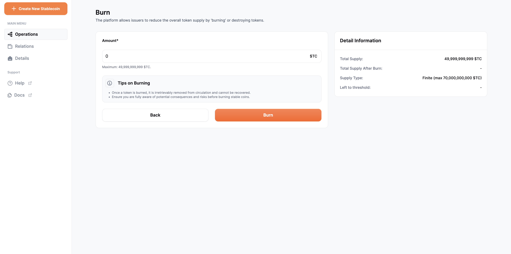

# Burn

When stablecoins are burned, it reduces the overall supply of the stablecoin. To do this, the user can click on the Burn box in the operations tab next to the Cash In box. This action leads to a new screen similar to the mint screen, where the user enters the amount to be burnt and then clicks on the burn button to proceed.

It's important to note the information displayed under the heading **Tips on Burning**, which informs the user of how this action is irreversible. Once burned, the coins cannot be recovered. The user should be fully aware of the consequences before proceeding with the burn operation.

