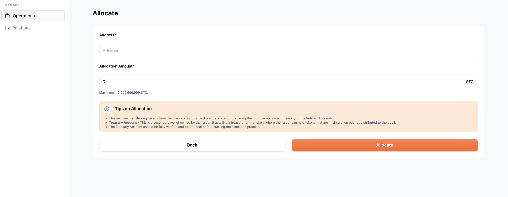

# Cash In

If the user wants to allocate stablecoin for circulation, they can click on the "Cash In" box next to the mint box. This action will navigate them to a screen where they have to enter specific details, such as the address for a treasury account. 

The treasury account serves as the holder of the stablecoins intended for circulation but not yet distributed. This is a secondary wallet owned by the user and needs to be verified and operational before the allocation process can begin.

The next step is to define the amount to be allocated. If the user decides to proceed, the stablecoin will be transferred from the main account to the treasury account and will be available for circulation.

