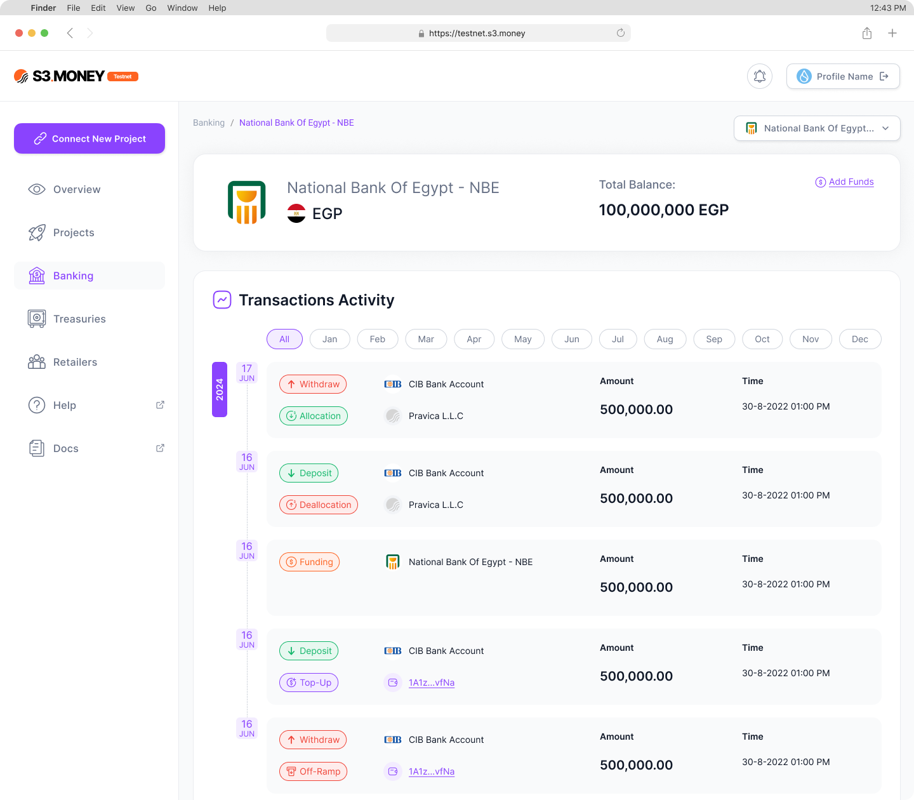

# Banking

The **Banking** section enables distributors to manage their simulated bank accounts and test reserve balances on the testnet. This section includes:

- **View Bank Accounts**: Displays a list of connected bank accounts, each with a virtual balance.
- **Add Funds**: Distributors can manually adjust the virtual balance for testing purposes, allowing for accurate simulation of deposits or withdrawals within the test environment.

---