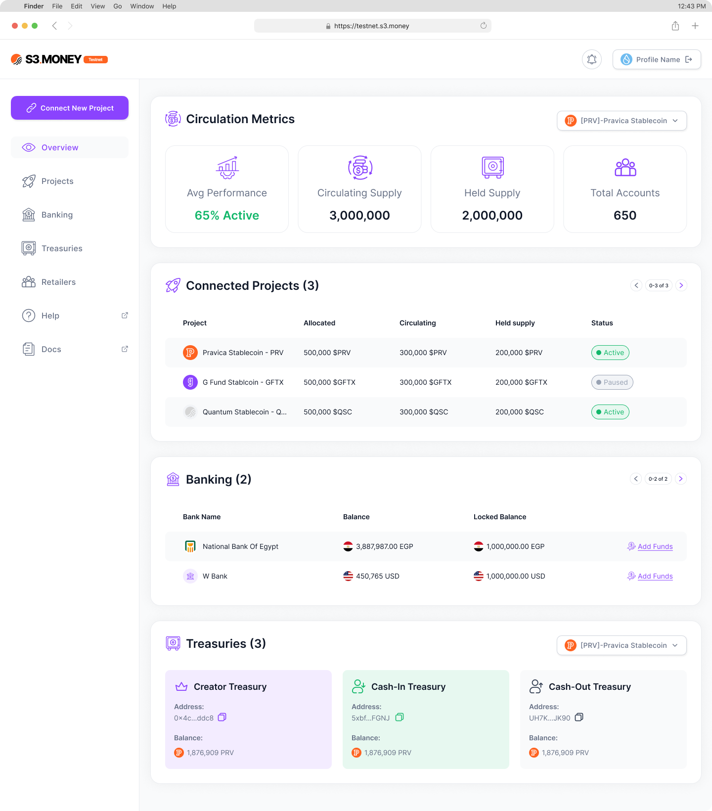

# Dashboard Overview
1. **Side Menu**
    - Accessible from the left sidebar, each section provides quick access to core tools and metrics within the Distributor Dashboard.
    - The **Connect New Project** button allows distributors to request connections to new projects, pending issuer approval.

---

## **Overview**

The **Overview** section provides distributors with a summary of distribution activities, bank details, and treasury balances. Key areas include:

- **Circulation Metrics**: Tracks token circulation, providing insight into token flow from treasuries into broader distribution.
- **Connected Projects**: Lists active projects with relevant metrics and brief overviews.
- **Banking Summary**: Shows total reserves and virtual balances in connected bank accounts.
- **Treasuries Summary**: Offers a snapshot of balances within each treasury (e.g., Cash-In, Cash-Out), helping distributors gauge their token capacity and distribution potential.

