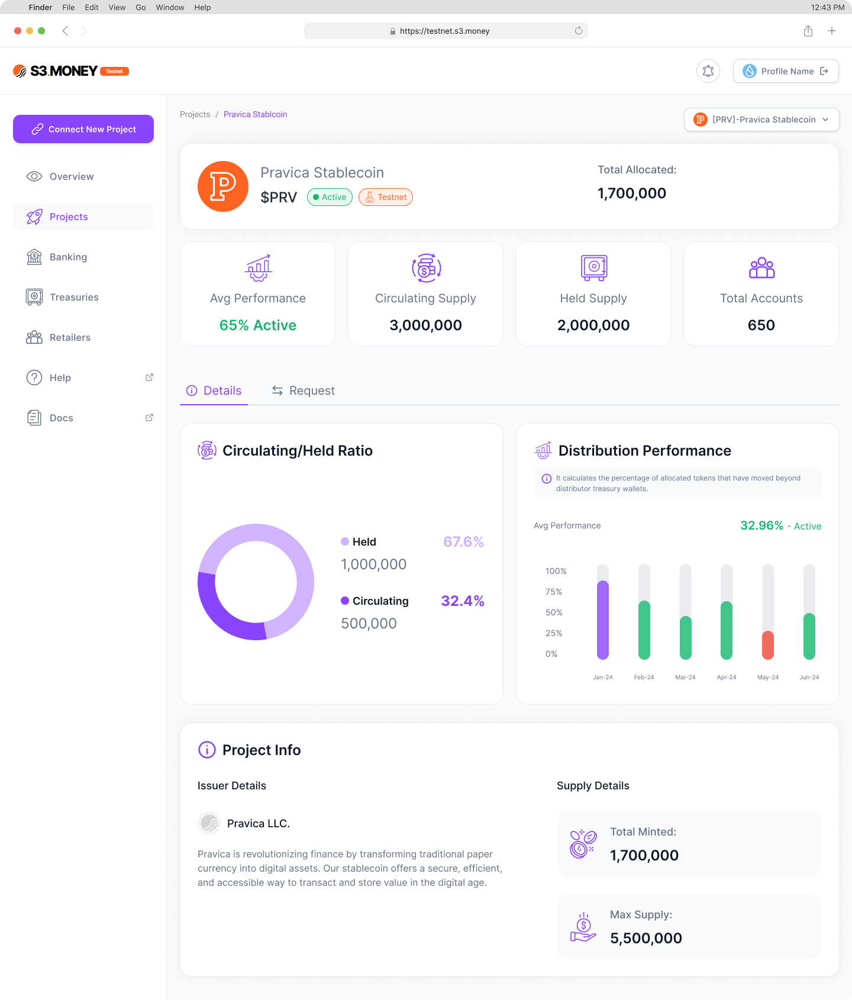
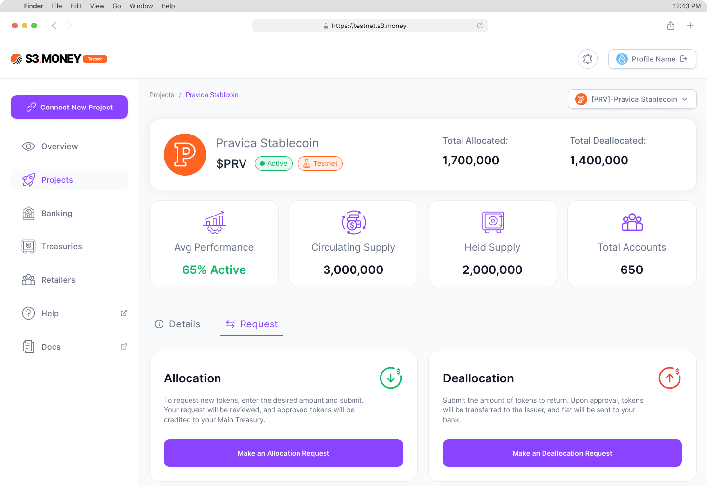

# Projects

The **Projects** section enables distributors to view and manage all connected projects. By selecting a project card, distributors can access detailed project metrics and requests.

Project Details

Upon selecting a project, distributors see a detailed view of metrics such as:

- **Distributing Performance**: This metric indicates how efficiently tokens are being distributed and adopted within the ecosystem.
- **Held vs. Circulated Supply Ratio**: Shows the proportion of tokens held in treasuries versus those in active circulation.
- **Project Info**: Displays important data like total tokens minted, maximum supply, and any issuer-provided information about the project.

### Requests Tab

The **Requests Tab** within each project allows distributors to interact with issuers for token management. Available actions include:

- **Allocation Requests**: Specify the amount of tokens to be allocated, which triggers a corresponding fiat deposit to the issuer’s reserve.
- **Deallocation Requests**: Specify the amount of tokens to be returned, resulting in a fiat withdrawal from the issuer’s reserve.

---