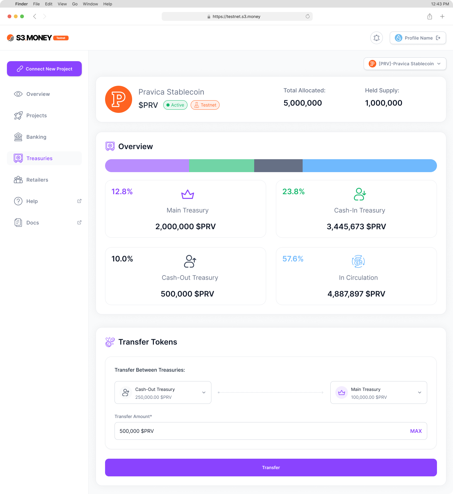

# Treasuries

In the **Treasuries** section, distributors can manage their treasuries and transfer tokens between them for efficient distribution and reserve management. This section includes:

- **Treasury Balances**: Displays current balances across **Cash-In, Cash-Out, and Main Treasuries**.
- **Treasury Transfers**: Distributors can initiate token transfers between treasuries to balance their token reserves based on distribution needs and pending allocation requests.

---
