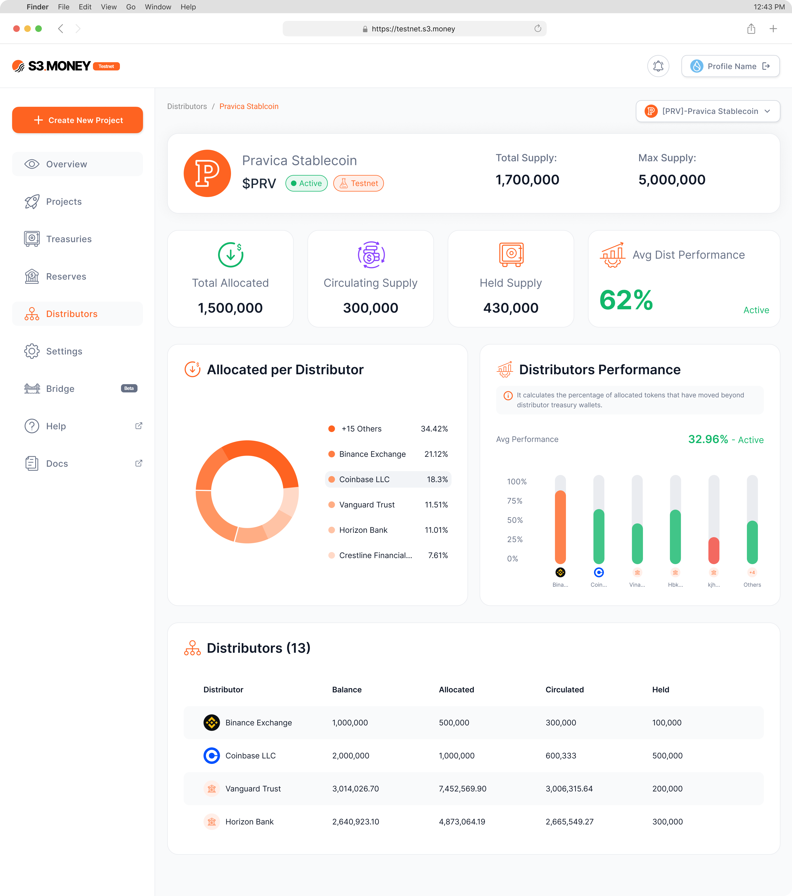
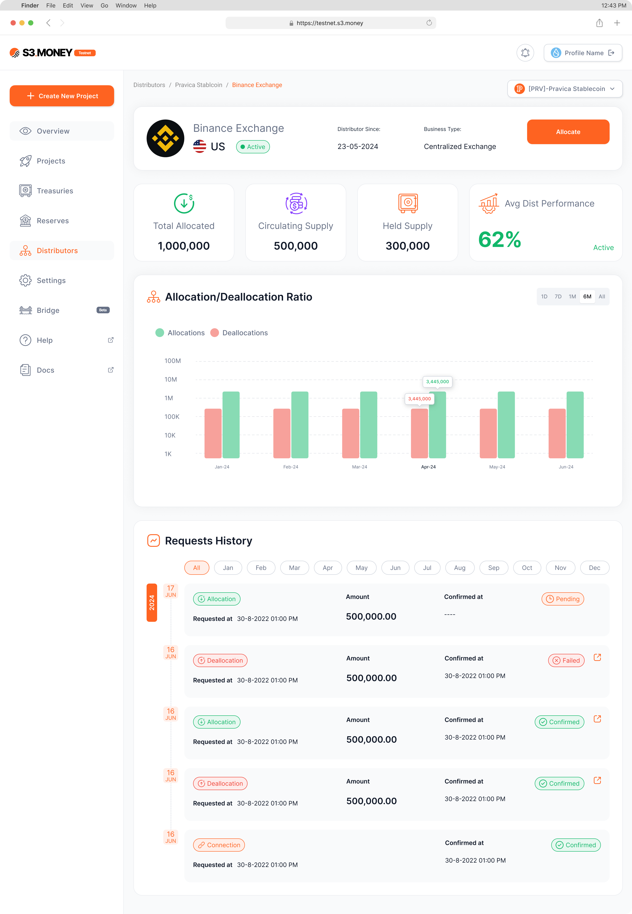

# Distributors Management
The **Distributors Management** section in S3.Money provides issuers with valuable insights into **distribution effectiveness**, helping track **token circulation, treasury balances, and distributor performance metrics**. With detailed, real-time metrics, issuers can monitor each distributor’s activities, identify high-impact distributors, and optimize token distribution strategies for improved adoption.

---

### **Navigating the Distributors Management Section**

1. **Accessing Distributors Management:**
    - From the **side menu**, select **Distributors** to enter the Distributors Management dashboard.
    - The main dashboard offers an **overview of distribution metrics**, recent activity, and distributor-specific summaries.
2. **Overview Metrics**
    - **Total Allocated**: Displays the cumulative number of tokens allocated across all distributors.
    - **Circulating Supply**: Shows tokens currently in active circulation, calculated as **Allocated Amount - Distributor Treasury Balances**.
    - **Distributor Performance**: A performance metric that tracks how efficiently distributors are moving tokens into circulation.

---

### **Distributor Activity and Treasury Metrics**

1. **Distributor Treasury Balances**
    - View each distributor’s Held Supply (sum of Main, Cash-In, and Cash-Out Treasuries balances).
    - Real-time updates give issuers immediate insight into distributor reserves and circulation capacity.
2. **Circulation Metrics**
    - The **amount of circulated tokens** is shown for each distributor, calculated by subtracting the treasury balance from the allocated total, allowing issuers to gauge demand and distribution.
3. **Distributor Performance**
    - **Definition**: This metric calculates the **percentage of allocated tokens** that have moved beyond the distributor’s treasury into broader circulation, helping assess the effectiveness of token distribution.

    - **Interpretation**:
        - **High Percentage**: Indicates effective distribution and widespread token adoption within the ecosystem.
        - **Low Percentage**: May suggest potential issues in distribution strategy or limited token liquidity.
    - **Levels of Performance**:
        - **Dormant (0-20%)**: Low or no activity in distribution; tokens remain largely within the distributor’s treasury.
        - **Active (21-70%)**: Steady distribution and redemption activity, indicating consistent engagement.
        - **High-Volume (71-100%)**: Strong distribution and redemption, reflecting high demand and broad adoption.
    
    Tracking **Token Circulation Efficiency** allows issuers to pinpoint high-performing distributors and identify areas for potential improvement in token flow.
    

---
### **Using Distributors Management to Optimize Distribution**

The Distributors Management section provides issuers with actionable insights, enabling them to:

- **Monitor Token Flow and Demand:**
    - Assess token movement and track treasury levels to maintain balance across distributor activities.
- **Refine Distribution Strategies:**
    - Use **Distributor Performance metrics** to adapt strategies based on engagement levels, ensuring tokens are effectively circulating and meeting demand.
- **Address Distribution Bottlenecks:**
    - Identify distributors with low performance metrics and work on improving liquidity or distribution support to boost token adoption.

---

The **Distributors Management** section in S3.Money offers issuers a data-rich view of their distribution network, complete with performance analysis, real-time treasury updates, and circulation metrics. By continuously tracking and optimizing these metrics, issuers can maximize their token distribution’s effectiveness, improve adoption rates, and foster a healthier, more active token ecosystem.