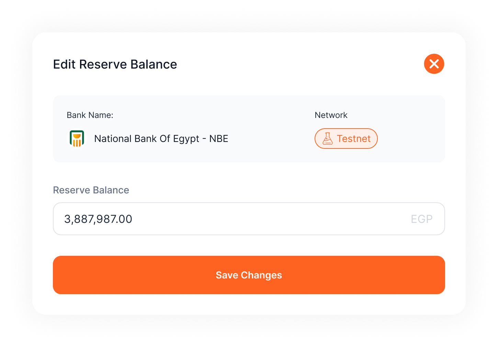

# Reserves Management
The **Reserves Management** section is essential for managing the **fiat reserves that back each token** in your project. Linked to the project’s bank account, this section ensures that every minted token is fully backed by fiat currency. While currently **simulated for testing purposes** (with editable, virtual balances), Reserves Management gives you a reliable way to experiment with and monitor reserve balances.

---

### **Navigating the Reserves Management Section**

1. **Accessing Reserves Management:**
    - From the **side menu**, select **Reserves** to access the Reserves Management section.
    - Here, you’ll see a list of all bank reserves linked to your different projects, each showing its current balance and more useful info.
2. **Understanding Reserve Balances:**
    - Each reserve displays a **virtual balance**, which represents the fiat backing for your stablecoins.
    - Since balances are simulated, you can freely **edit and test different reserve amounts** to see how they would impact token backing.

---

### **Editing Reserve Balances**

To **add or adjust the balance** in a reserve, follow these steps:

1. **Select a Reserve:**
    - In the Reserves Management section, click on the reserve you wish to edit.
2. **Edit Balance:**
    - Once in the reserve’s detailed view, locate the **Edit Balance** button in the upper-right corner of the header section.
3. **Enter New Balance:**
    - Specify the amount you want to add or set as the new balance. This action simulates a deposit into the reserve, adjusting the backing amount for potential token minting.
4. **Save Changes:**
    - Confirm and save the balance update. The virtual balance will reflect your changes immediately.

---

### **Practical Use of Reserves Management**

While in testing mode, Reserves Management helps you simulate **real-world scenarios** by adjusting fiat reserves as needed. For example:

- **Testing Mint Thresholds:**
    
    Simulate how adjusting reserve balances impacts your minting threshold. For example, adding funds in the virtual reserve can increase the number of tokens you’re able to mint.
    
- **Experimenting with Allocations:**
    
    Test how balance changes affect token distribution to ensure sufficient backing during high-demand periods.
    

---

### **Future Live Integration**

Once transitioned from testing to live operations, Reserves Management will connect to actual bank accounts, enabling real fiat balance monitoring and adjustments in line with S3.Money’s compliance standards. All adjustments will directly correlate to bank deposits, ensuring that each token remains fully backed by fiat reserves.

The **Reserves Management** section provides a streamlined, test-friendly way to prepare for efficient, backed token operations, keeping your project well-prepared for live deployment.

---
