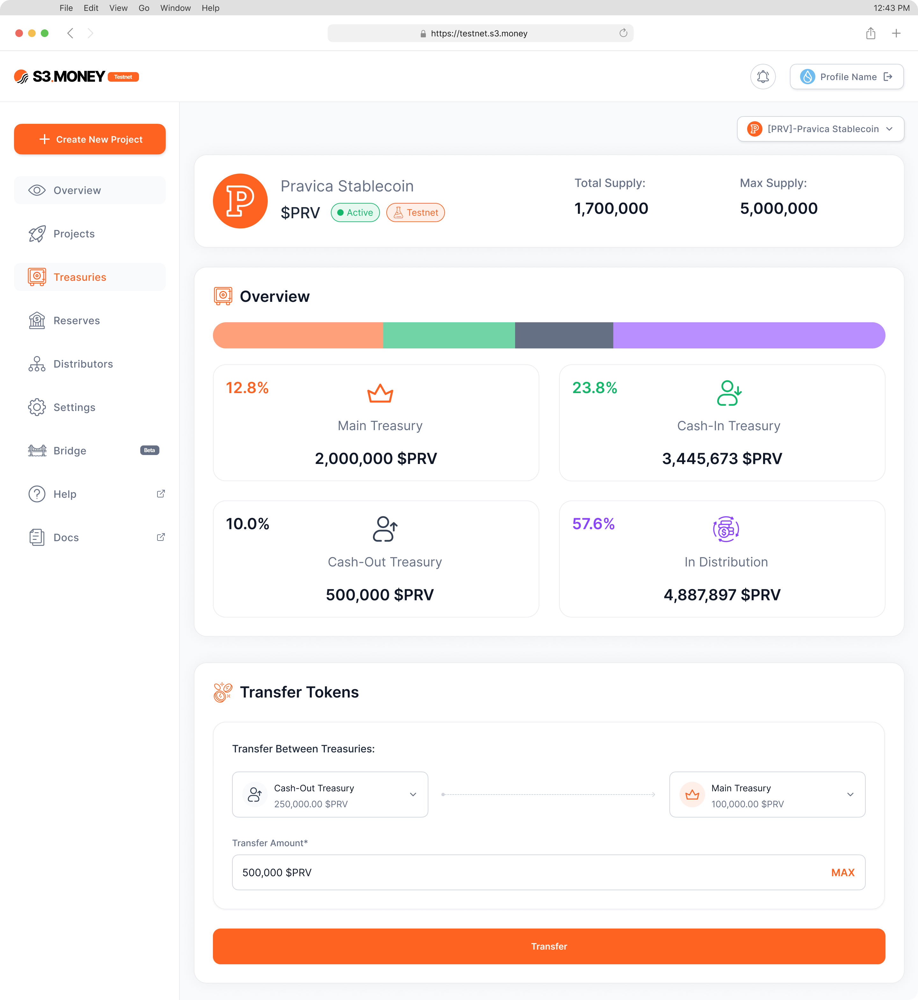

# Treasuries Management
### **Understanding and Managing Treasuries**

The Treasury Management section organizes treasuries into **Main, Cash-In, and Cash-Out**, each serving a unique function.

1. **Main Treasury**
    - **Purpose:** The Main Treasury is the core of your token supply, responsible for **minting new tokens, burning existing ones, and freezing or unfreezing addresses**.
    - **Actions:** Perform high-level tasks such as creating tokens, managing supply, or setting token restrictions.
2. **Cash-In Treasury**
    - **Purpose:** The Cash-In Treasury receives tokens from the Main Treasury and redistributes them to distributors.
    - **Actions:** Allocate tokens to distributors’ treasuries for distribution, and receive returned tokens from Cash-Out Treasuries.
3. **Cash-Out Treasury**
    - **Purpose:** This treasury handles token outflows, particularly for **redeeming or deallocating tokens**.
    - **Actions:** Initiate token withdrawals from the system or return deallocated tokens to the Cash-In Treasury.

### **Transferring Funds Between Treasuries**

1. **Step 1:** Go to **Treasury Management > Transfer Tokens**.
2. **Step 2:** Choose the **source treasury** (Main, Cash-In, Cash-Out) and **destination treasury**.
3. **Step 3:** Specify the **amount** and **confirm the transfer**. The transaction will be logged in the history.

