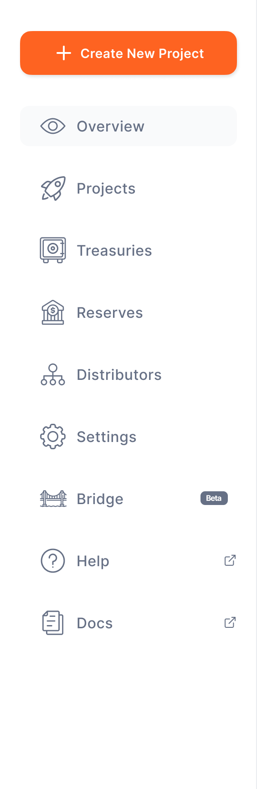

# Sidebar Navigation

### **Dashboard Home**

The **sidebar menu** allows easy access to the platform’s key areas:

- **Overview:** Monitor live statistics and distributor activities in real time.
    
- **Projects:** Create, distribute, and manage tokenized money through the platform’s project tools.
    
- **Treasuries:**
    View and manage balances across **Main, Cash-In, and Cash-Out Treasuries**. Initiate fund transfers between treasuries as needed.
    
- **Distributors:** Handle **allocation, deallocation, and connection requests** from distributors, ensuring smooth token distribution.
    
- **Reserves:** Manage **bank accounts and reserves**, and verify fiat transactions that back tokenized money.
    
