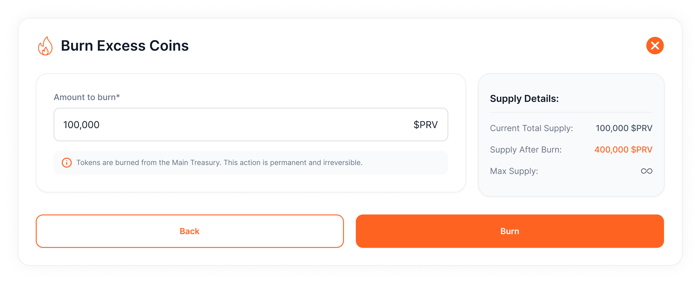

# Burn Excess Supply
If the token supply exceeds demand, follow these steps to **burn tokens** and reduce circulation:

1. **Access the Project:**
    - Navigate to **Projects > Select Project Card**.
2. **Open Burn Function:**
    - Go to **Operations Tab > Burn Excess Coins**.
3. **Enter Burn Amount:**
    - Specify the **number of tokens** to burn and click **Burn**.
4. **Sign the Transaction:**
    - Confirm the burn operation by **signing the transaction** through your wallet extension.

