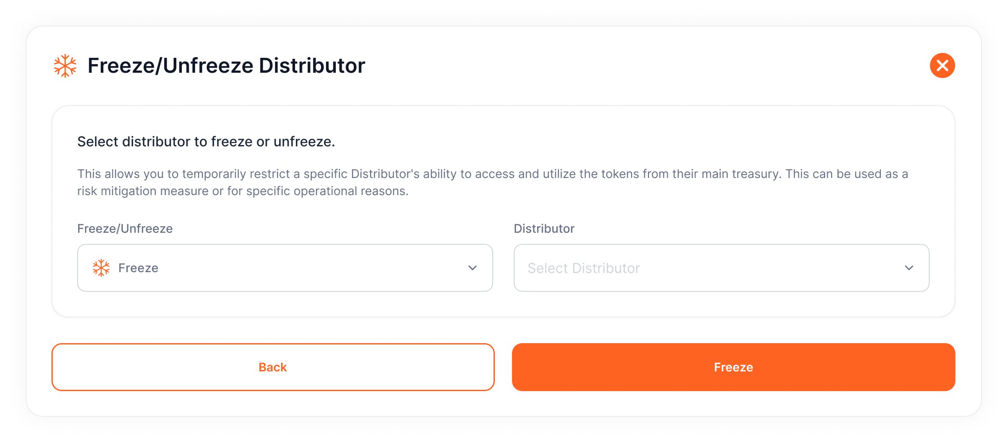

# Freeze or Unfreeze Distributors
Freezing and unfreezing distributors allows you to **suspend or resume token operations** with specific accounts when necessary.

1. **Access the Project:**
    - Navigate to **Projects > Select Project Card**.
2. **Open Freeze/Unfreeze Function:**
    - Go to **Operations Tab > Freeze/Unfreeze Distributor**.
3. **Select Distributor and Action:**
    - Choose **Freeze** or **Unfreeze** from the options and select the distributor from the dropdown list.
    - Click **Freeze** or **Unfreeze** based on your intended action.
4. **Sign the Action:**
    - **Sign the function call** through your wallet extension to complete the process.

