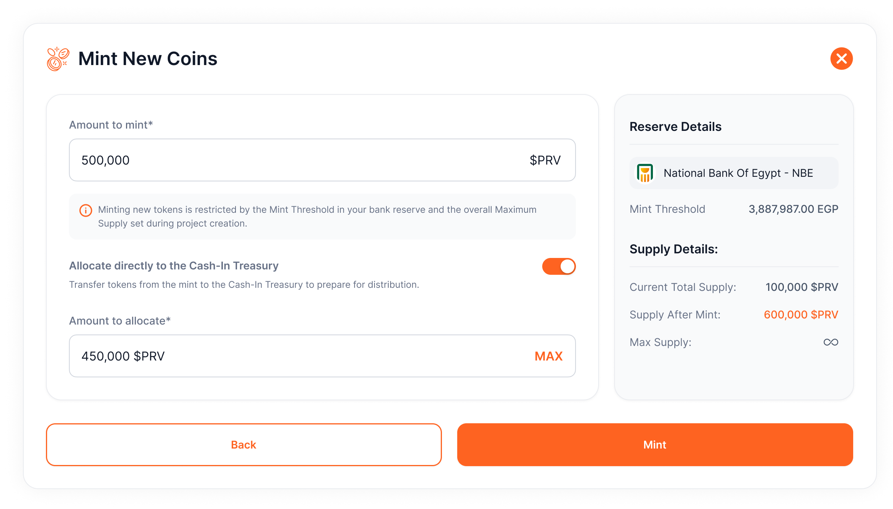

# Mint New Coins
Follow these steps to mint new tokens:

1. **Access the Project:**
    - Navigate to **Projects > Select Project Card** (switch between projects using the dropdown menu at the top right).
2. **Go to Operations:**
    - Open the **Operations Tab > Mint New Coins**.
3. **Enter Amount:**
    - Specify the **exact amount** of coins to mint. Ensure this amount is within the **minting threshold** of your bank reserves. If additional coins are needed, **add funds** to your reserves to maintain 1:1 backing.
4. **Enable Automatic Transfer:**
    - Toggle the switch to **automatically transfer** a portion of the newly minted coins from the **Main Treasury to the Cash-In Treasury** after minting.
5. **Mint and Sign:**
    - Click **Mint** and **sign the transaction** through your wallet extension. If automatic transfer is enabled, you’ll be prompted to sign an additional transaction.

