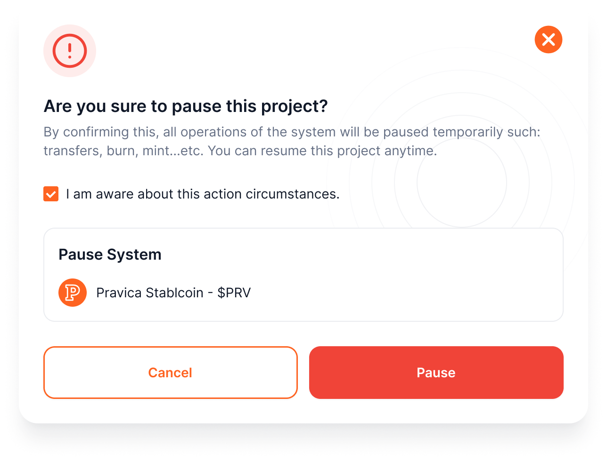

# Pause Project Operations
Pausing a project temporarily **halts all token activities** to manage issues or maintenance without canceling the project.

1. **Access the Project:**
    - Navigate to **Projects > Select Project Card**.
2. **Go to Pause Function:**
    - Open the **Operations Tab > Pause Project**.
3. **Acknowledge Action:**
    - Check the box confirming you understand the consequences of pausing operations.
4. **Pause and Sign:**
    - Click **Pause** and **sign the action** via your wallet extension to confirm.

