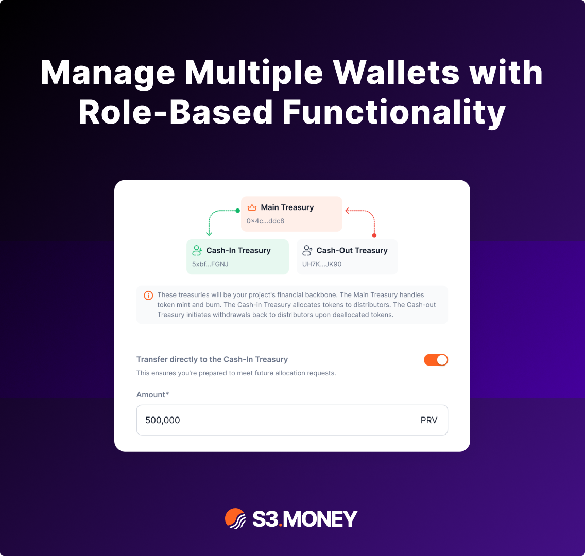
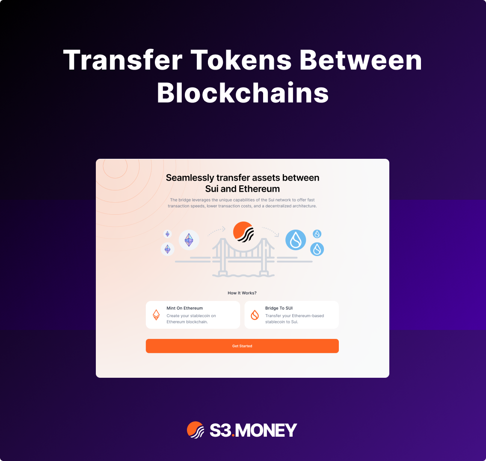
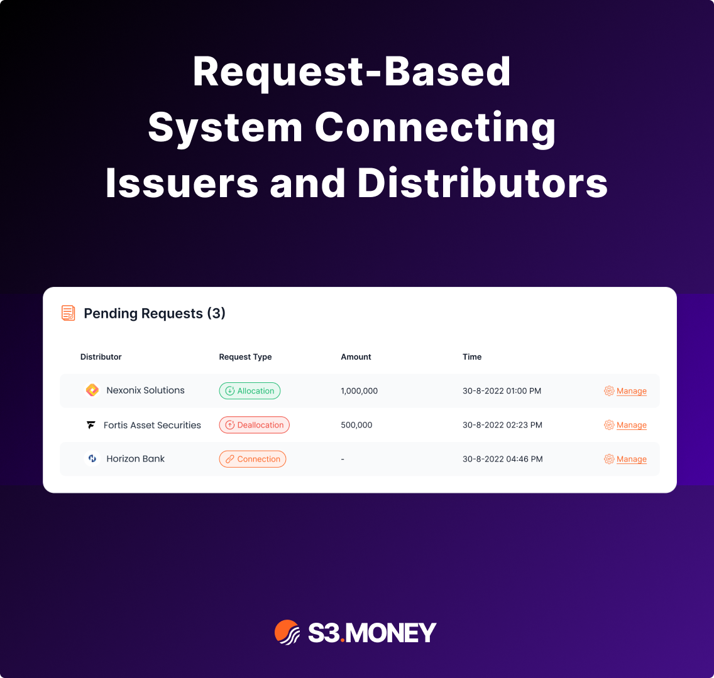
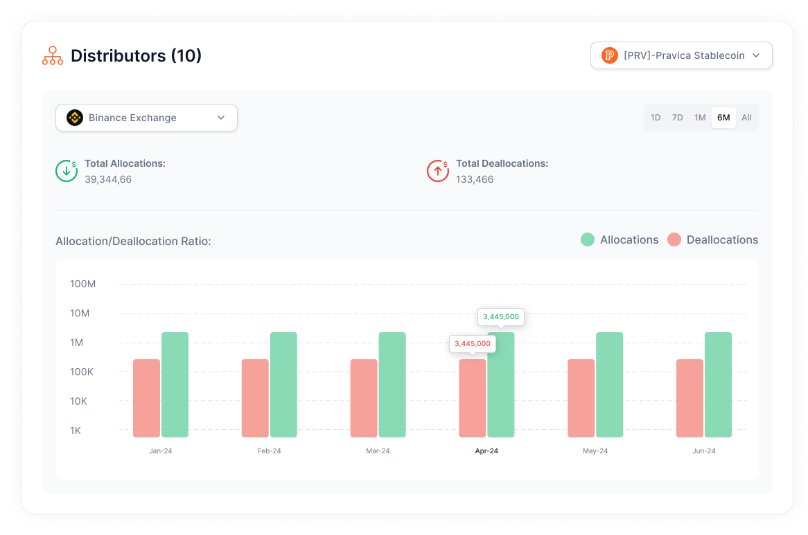
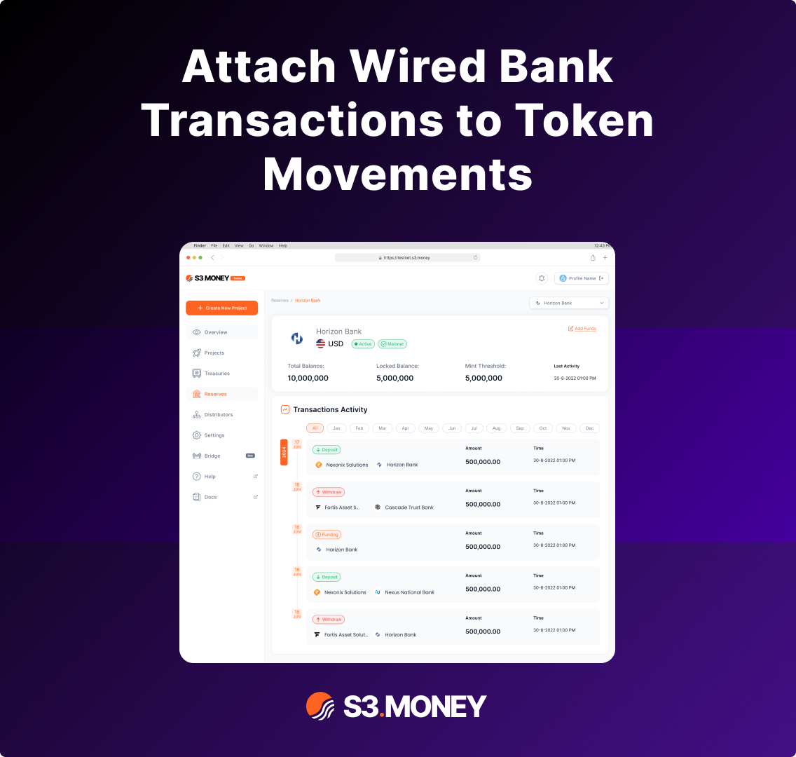

# Use Cases

### **1. Tokenization Made Simple**

Tokenization converts fiat currency (e.g., USD, EUR) into digital tokens, maintaining a 1:1 ratio between the tokens and the fiat reserves held in bank accounts. This ensures that every token in circulation is fully backed by real-world currency, maintaining user confidence and regulatory compliance.

**Real-Life Example:**

A **real estate developer** uses S3.Money to tokenize investor funds. When investors wire fiat currency, the funds are converted into tokens that can be traded within a private blockchain network, representing shares of the development project. Investors can track their holdings and transfer tokens, knowing each token is securely backed by the wired deposit.

> **Blog**: [Read our blog post about this from here](https://www.s3.money/post/amplify-your-business-of-tokenizing-money-and-let-s3-handle-the-rest).
> 

---

### **2. Seamless Treasury Management**

S3.Money’s treasury management allows users to create multiple wallets, each with **specific roles and permissions**. This structure prevents operational errors and reduces risks by ensuring that wallets only perform tasks relevant to their roles—like minting tokens, allocating funds, or making payments.

**Real-Life Example:**

A **cryptocurrency exchange** using S3.Money assigns different roles to wallets. The **Main Treasury** mints tokens and manages supply, while the **Cash-In Treasury** receives incoming funds from users. The **Cash-Out Treasury** processes withdrawals when users exchange tokens for fiat. Role-based restrictions ensure that only the Main Treasury can mint tokens, reducing the risk of misuse by employees.

> **Blog**: [Read our blog post about this from here.](https://www.s3.money/post/mastering-treasury-management-with-s3-money)
> 

---

### **3. Bridge Functionality for Cross-Chain Mobility**

S3.Money’s bridge feature enables tokens to **move across different blockchains**, maintaining the same value and functionality across networks. This allows businesses to expand liquidity and reach users on multiple platforms without needing to reissue tokens on each blockchain.

**Real-Life Example:**

A **fintech startup** initially issues tokens on Ethereum but later decides to expand to the Sui Blockchain for faster, cheaper transactions. Instead of re-minting tokens, they use S3.Money’s bridge to transfer their existing token supply between chains, ensuring uninterrupted liquidity and access for users on both networks.

> **Blog**: [Read our blog post about this from here.](https://www.s3.money/post/bridging-blockchains-for-better-token-mobility)
> 

---

### **4. Request-Based System**

**Manage Allocation, Deallocation, and Connection Requests:**

S3.Money streamlines the relationship between issuers and distributors through a **request-based system**. Distributors submit requests for token allocations or deallocations, with each request linked to a fiat transaction for transparency. Issuers approve or reject these requests through the platform, ensuring smooth operations and accountability.

**Real-Life Example:**

A **partner bank** distributing stablecoins submits an **allocation request** to the issuer via S3.Money. The request includes a wired transaction from the bank’s account to the issuer’s account, ensuring the tokens are backed by fiat. Once approved, tokens are allocated to the bank’s treasury, ready to be distributed to clients through the bank’s mobile app.

> **Blog**: [Read our blog post about this from here.](https://www.s3.money/post/simplifying-issuer-distributor-relationships)
> 

---

### **5. Real-Time Analytics**

S3.Money provides an **analytics dashboard** with real-time insights into token flows, treasury balances, and transaction histories. Users can monitor performance, review requests, and track allocation and deallocation activities to make informed decisions.

**Real-Life Example:**

A **payment processor** working with multiple distributors uses the dashboard to monitor token allocations in real time. When an anomaly—such as an unusually high deallocation request—appears, the platform triggers an alert, allowing the processor to investigate the issue promptly and maintain operational integrity.

---

### **6. Fiat Integration:**

S3.Money ensures **full transparency** by automatically linking wired fiat transactions to token movements. When tokens are allocated or deallocated, the corresponding bank transfer is logged alongside the transaction, creating a seamless connection between the fiat and tokenized worlds.

**Real-Life Example:**

A **luxury goods retailer** working with tokenized deposits submits a **deallocation request** to withdraw some tokens and redeem fiat. The issuer’s system automatically attaches the wired bank transaction that returns fiat to the retailer’s account, ensuring transparency and preventing reconciliation errors.

> **Blog**: [Read our blog post about this from here.](https://www.s3.money/post/effortless-reserve-management-with-s3-money-dashboard)
> 

---