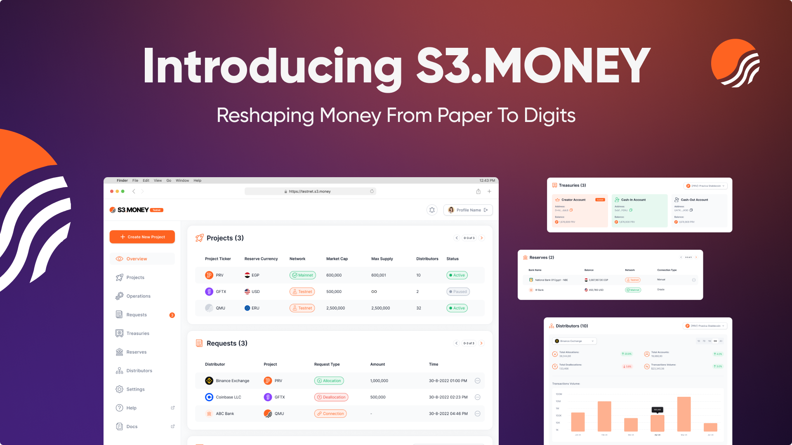

# What is S3.Money?

S3.Money is more than just a platform—it’s the key to unlocking the potential of digital finance. Designed for modern businesses, financial institutions, and governments, it offers a **seamless infrastructure to manage tokenized money**. From the moment fiat currency is tokenized to when it flows through various treasuries and is distributed among partners, S3.Money ensures every step is **secure, efficient, and transparent**.

With S3.Money, managing **stablecoins, tokenized deposits, and payments** becomes frictionless. The platform connects issuers, distributors, and retailers through **requests, treasury management tools, and bank integration**, bridging real-world financial systems with digital ecosystems.

Whether you're creating tokens, distributing them across networks, or managing treasury flows, S3.Money equips you with **the tools to stay ahead**, reduce complexity, and scale operations confidently.

